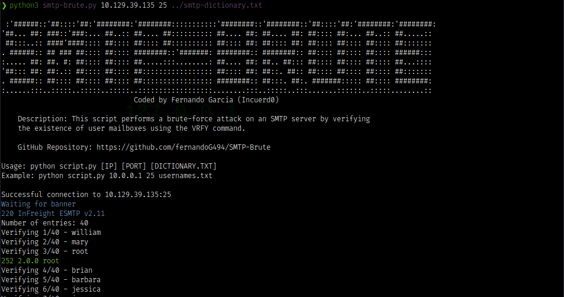

# SMTP-Brute

SMTP-Brute is a Python script designed to perform a brute-force attack on an SMTP server by verifying the existence of user mailboxes using the VRFY command.

## Features

- Connects to an SMTP server using Telnet.
- Verifies the existence of user mailboxes with the VRFY command.
- Handles server responses and reconnects in case of errors.

## How to run
1. Clone the repo
```bash
git clone https://github.com/example/smtp-brute.git
cd smtp-brute
```

2. Run the script
```bash
python script.py [IP] [PORT] [DICTIONARY.TXT]
```
- IP: IP address of the target SMTP server.
- PORT: Port number to connect to the SMTP server.
- DICTIONARY.TXT: Text file containing a list of usernames to check.

### Example
```bash
python script.py 10.0.0.1 25 usernames.txt
```




## Author
Coded by Fernando García, a.k.a Incuerd0

HTB Profile: https://app.hackthebox.com/profile/20709

LinkedIn: https://www.linkedin.com/in/lfgc

## License
This project is licensed under the [MIT License](./LICENSE).
